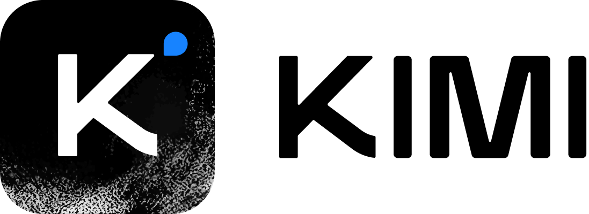

  

    
    

      
Trusted by Partners

      
      
      
      
      
    

  

| [**Gradient**](https://gradient.network)
| [**Blog**](https://gradient.network/blog/parallax-the-sovereign-ai-os)
| [**X(Twitter)**](https://x.com/Gradient_HQ)
| [**Discord**](https://discord.gg/parallax)
| [**Arxiv**](https://arxiv.org/pdf/2509.26182v1)

## News
- [2025/10] 🔥 Parallax won #1 Product of The Day on Product Hunt!
- [2025/10] 🔥 Parallax version 0.0.1 has been released!

## About
A fully decentralized inference engine developed by [Gradient](https://gradient.network). Parallax lets you build your own AI cluster for model inference onto a set of distributed nodes despite their varying configuration and physical location. Its core features include:

- **Host local LLM on personal devices**
- **Cross-platform support**
- **Pipeline parallel model sharding**
- **Dynamic KV cache management & continuous batching for Mac**
- **Dynamic request scheduling and routing for high performance**

The backend architecture:

* P2P communication powered by [Lattica](https://github.com/GradientHQ/lattica)
* GPU backend powered by [SGLang](https://github.com/sgl-project/sglang)
* MAC backend powered by [MLX LM](https://github.com/ml-explore/mlx-lm)

## User Guide

- [Installation](./docs/user_guide/install.md)
- [Getting Started](./docs/user_guide/quick_start.md)

## Contributing

We warmly welcome contributions of all kinds! For guidelines on how to get involved, please refer to our [Contributing Guide](./docs/CONTRIBUTING.md).

## Supported Models

|              | Provider     | HuggingFace Collection  |  Blog  | Description |
|:-------------|:-------------|:----------------------------:|:----------------------------:|:----------------------------|
|DeepSeek      | Deepseek     | [DeepSeek-V3.1](https://huggingface.co/collections/deepseek-ai/deepseek-v31)  [DeepSeek-R1](https://huggingface.co/collections/deepseek-ai/deepseek-r1)  [DeepSeek-V3](https://huggingface.co/collections/deepseek-ai/deepseek-v3)  [DeepSeek-V2](https://huggingface.co/collections/deepseek-ai/deepseek-v2) | [DeepSeek V3.1: The New Frontier in Artificial Intelligence](https://deepseek.ai/blog/deepseek-v31) | "DeepSeek" is an advanced large language model series from Deepseek AI, offering multiple generations such as DeepSeek-V3.1, DeepSeek-R1, DeepSeek-V2, and DeepSeek-V3. These models are designed for powerful natural language understanding and generation, with various sizes and capabilities for research and production use. |
|MiniMax-M2    | MiniMax AI  | [MiniMax-M2](https://huggingface.co/MiniMaxAI/MiniMax-M2) | [MiniMax M2 & Agent: Ingenious in Simplicity](https://www.minimax.io/news/minimax-m2) | MiniMax-M2 is a compact, fast, and cost-effective MoE model (230B parameters, 10B active) built for advanced coding and agentic workflows. It offers state-of-the-art intelligence and coding abilities, delivering efficient, reliable tool use and strong multi-step reasoning for developers and agents, with high throughput and low latency for easy deployment. |
|GLM-4.6       | Z AI | [GLM-4.6](https://huggingface.co/zai-org/GLM-4.6) | [GLM-4.6: Advanced Agentic, Reasoning and Coding Capabilities](https://z.ai/blog/glm-4.6) | GLM-4.6 improves upon GLM-4.5 with a longer 200K token context window, stronger coding and reasoning performance, enhanced tool-use and agent integration, and refined writing quality. Outperforms previous versions and is highly competitive with leading open-source models across coding, reasoning, and agent benchmarks. |
|Kimi-K2       | Moonshot AI  | [Kimi-K2](https://huggingface.co/collections/moonshotai/kimi-k2-6871243b990f2af5ba60617d) | [Kimi K2: Open Agentic Intelligence](https://moonshotai.github.io/Kimi-K2/) | "Kimi-K2" is Moonshot AI's Kimi-K2 model family, including Kimi-K2-Base, Kimi-K2-Instruct and Kimi-K2-Thinking. Kimi K2 Thinking is a state-of-the-art open-source agentic model designed for deep, step-by-step reasoning and dynamic tool use. It features native INT4 quantization and a 256k context window for fast, memory-efficient inference. Uniquely stable in long-horizon tasks, Kimi K2 enables reliable autonomous workflows with consistent performance across hundreds of tool calls.
|Qwen          | Qwen         | [Qwen3-Next](https://huggingface.co/collections/Qwen/qwen3-next-68c25fd6838e585db8eeea9d)  [Qwen3](https://huggingface.co/collections/Qwen/qwen3-67dd247413f0e2e4f653967f)  [Qwen2.5](https://huggingface.co/collections/Qwen/qwen25-66e81a666513e518adb90d9e)| [Qwen3-Next: Towards Ultimate Training & Inference Efficiency](https://qwen.ai/blog?id=4074cca80393150c248e508aa62983f9cb7d27cd&from=research.latest-advancements-list) | The Qwen series is a family of large language models developed by Alibaba's Qwen team. It includes multiple generations such as Qwen2.5, Qwen3, and Qwen3-Next, which improve upon model architecture, efficiency, and capabilities. The models are available in various sizes and instruction-tuned versions, with support for cutting-edge features like long context and quantization. Suitable for a wide range of language tasks and open-source use cases. |
|gpt-oss       | OpenAI       | [gpt-oss](https://huggingface.co/collections/openai/gpt-oss-68911959590a1634ba11c7a4)  [gpt-oss-safeguard](https://huggingface.co/collections/openai/gpt-oss-safeguard) | [Introducing gpt-oss-safeguard](https://openai.com/index/introducing-gpt-oss-safeguard/) | gpt-oss are OpenAI’s open-weight GPT models (20B & 120B). The gpt-oss-safeguard variants are reasoning-based safety classification models: developers provide their own policy at inference, and the model uses chain-of-thought to classify content and explain its reasoning. This allows flexible, policy-driven moderation in complex or evolving domains, with open weights under Apache 2.0. |
|Meta Llama 3  | Meta         | [Meta Llama 3](https://huggingface.co/collections/meta-llama/meta-llama-3-66214712577ca38149ebb2b6)  [Llama 3.1](https://huggingface.co/collections/meta-llama/llama-31-669fc079a0c406a149a5738f)  [Llama 3.2](https://huggingface.co/collections/meta-llama/llama-32-66f448ffc8c32f949b04c8cf)  [Llama 3.3](https://huggingface.co/collections/meta-llama/llama-33-67531d5c405ec5d08a852000) | [Introducing Meta Llama 3: The most capable openly available LLM to date](https://ai.meta.com/blog/meta-llama-3/) | "Meta Llama 3" is Meta's third-generation Llama model, available in sizes such as 8B and 70B parameters. Includes instruction-tuned and quantized (e.g., FP8) variants. |
