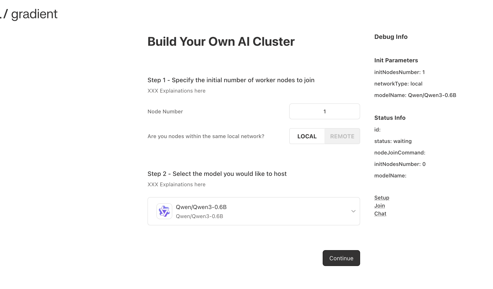
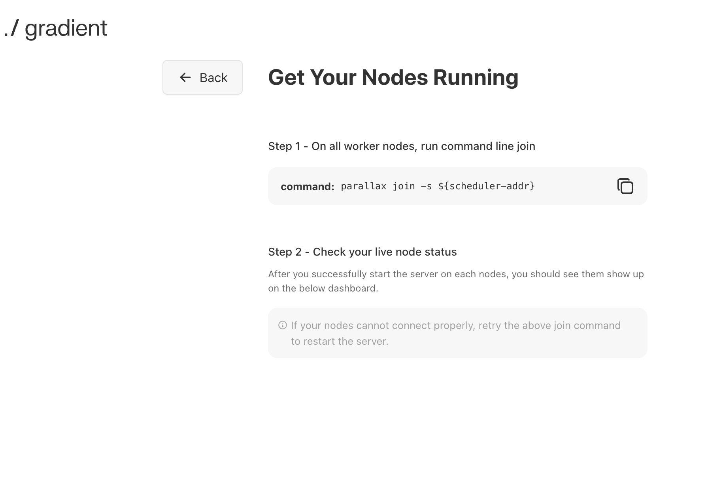

<!-- <div align="center">
  <p align="center">
    
  </p>
</div> -->

# Parallax
A fully decentralized inference engine developed by [Gradient](https://gradient.network). Parallax lets you build your own AI cluster for model inference onto a set of distributed nodes despite their varying configuration and physical location.
<!-- <h3> -->

| [**Gradient**](https://gradient.network)
| [**Blog**](https://gradient.network/blog/parallax-world-inference-engine)
| [**X(Twitter)**](https://x.com/Gradient_HQ)
| [**Discord**](https://discord.gg/gradientnetwork)

🔥 **NEW: Parallax version 0.0.1 has been released!**

<!-- </h3> -->

## Features
* Run LLM at home with personal devices.
* Cross-platform support.
* Pipeline parallel model sharding.
* Dynamic KV cache management + continuous batching for MAC.
* Dynamic request scheduling and routing for high performance.

## Backend Architecture
* P2P communication powered by [Lattica](https://github.com/GradientHQ/lattica)
* GPU backend powered by [SGLang](https://github.com/sgl-project/sglang)
* MAC backend powered by [MLX LM](https://github.com/ml-explore/mlx-lm)

## Installation

### Prerequisites
- Python>=3.11.0
- Ubuntu-24.04 for Blackwell GPUs

Below are installation methods for different operating systems.

|  Operating System  |  Windows App  |  From Source | Docker |
|:-------------|:----------------------------:|:----------------------------:|:----------------------------:|
|Windows       | ✅️ | Not recommended | Not recommended |
|Linux | ❌️ | ✅️ | ✅️ |
|macOS | ❌️ | ✅️ | ❌️ |

### From Source
- For Linux/WSL (GPU):
```sh
git clone https://github.com/GradientHQ/parallax.git
cd parallax
pip install -e '.[gpu]'
```

- For macOS (Apple silicon):
```sh
git clone https://github.com/GradientHQ/parallax.git
cd parallax
pip install -e '.[mac]'
```

- Extra step for development:
```sh
pip install -e '.[dev]'
```

### Windows Application
[Click here](https://github.com/GradientHQ/parallax/releases/latest/download/Gradient_Parallax_PC_Setup.exe) to get latest Windows installer.

After installing .exe, right click Windows start button and click ```Windows Terminal(Admin)``` to start a Powershell console as administrator.

Start Windows dependencies installation by simply typing this command in console:
```sh
parallax install
```

Installation process may take around 30 minutes.

To see a description of all Parallax Windows configurations you can do:
```sh
parallax --help
```

### Docker
For Linux+GPU devices, Parallax provides a docker environment for quick setup. Choose the docker image according to the device's GPU architechture.

|  GPU Architecture  |  GPU Series  | Image Pull Command |
|:-------------|:----------------------------|:----------------------------|
|Blackwell       | RTX50 series/B100/B200... |```docker pull gradientservice/parallax:latest-blackwell```|
|Ampere/Hopper | RTX30 series/RTX40 series/A100/H100... |```docker pull gradientservice/parallax:latest-hopper```|

Run a docker container as below. Please note that generally the argument ```--gpus all``` is necessary for the docker to run on GPUs.
```sh
# For Blackwell
docker run -it --gpus all --network host gradientservice/parallax:latest-blackwell bash
# For Ampere/Hopper
docker run -it --gpus all --network host gradientservice/parallax:latest-hopper bash
```
The container starts under parallax workspace and you should be able to run parallax directly.

## Getting started

We will walk through you the easiest way to quickly set up your own AI cluster

### With Frontend

#### Step 1: Launch scheduler

First launch our scheduler on the main node, we recommend you to use your most convenient computer for this.
- For Linux/macOS:
```sh
parallax run
```

- For Windows, start Powershell console as administrator and run:
```sh
parallax run
```

#### Step 2: Select model config

Open http://localhost:3001 and you should see the setup interface.



Select your desired node and model config and click continue.

#### Step 3: Join each distributed nodes

Copy the generated join command line to your node and run.

```sh
# local area network env
parallax join
# public network env
parallax join -s {scheduler-address}
# example
parallax join -s /ip4/192.168.1.2/tcp/5001/p2p/xxxxxxxxxxxx
```



You should see your nodes start to show up with their status. Wait until all nodes are successfully connected, and you will automatically be directed to the chat interface.

#### Step 4: Chat

Done! You have your own AI cluster now.


### Without frontend
#### Step 1: Launch scheduler
First launch our scheduler on the main node.
```sh
parallax run -m {model-name} -n {number-of-worker-nodes}
```
For example:
```sh
parallax run -m Qwen/Qwen3-0.6B -n 2
```
Please notice and record the scheduler ip4 address generated in the terminal.

#### Step 2: Join each distributed nodes
For each distributed nodes including the main node, open a terminal and join the server with the scheduler address.
```sh
# local area network env
parallax join
# public network env
parallax join -s {scheduler-address}
```
For example:
```sh
# first node
parallax join -s /ip4/192.168.1.2/tcp/5001/p2p/xxxxxxxxxxxx
# second node
parallax join -s /ip4/192.168.1.2/tcp/5001/p2p/xxxxxxxxxxxx
```

#### Step 3: Call chat api with Scheduler
```sh
curl --location 'http://localhost:3001/v1/chat/completions' --header 'Content-Type: application/json' --data '{
    "max_tokens": 1024,
    "messages": [
      {
        "role": "user",
        "content": "hello"
      }
    ],
    "stream": true
}'
```

### Skipping Scheduler
Developers can start Parallax backend engine without a scheduler. Pipeline parallel start/end layers should be set manually.
An example of serving Qwen3-0.6B with 2-nodes:
- First node:
```sh
python3 ./parallax/src/parallax/launch.py \
--model-path Qwen/Qwen3-0.6B \
--port 3000 \
--dht-port 5000 \
--max-batch-size 8 \
--start-layer 0 \
--end-layer 14
```
- Second node:
```sh
python3 ./parallax/src/parallax/launch.py \
--model-path Qwen/Qwen3-0.6B \
--port 3000 \
--dht-port 5000 \
--max-batch-size 8 \
--start-layer 14 \
--end-layer 28
```

Call chat API on one of the nodes:
```sh
curl --location 'http://localhost:3000/v1/chat/completions' --header 'Content-Type: application/json' --data '{
    "max_tokens": 1024,
    "messages": [
      {
        "role": "user",
        "content": "hello"
      }
    ],
    "stream": true
}'
```

## Supported Models

|              |  HuggingFace  |  Blog  |
|:-------------|:----------------------------:|:----------------------------:|
|GPT-OSS       |[Link](https://huggingface.co/collections/openai/gpt-oss-68911959590a1634ba11c7a4)|[Link](https://openai.com/index/introducing-gpt-oss/)|
|Qwen3-Next    |[Link](https://huggingface.co/collections/Qwen/qwen3-next-68c25fd6838e585db8eeea9d)|[Link](https://qwen.ai/blog?id=4074cca80393150c248e508aa62983f9cb7d27cd&from=research.latest-advancements-list)|
|Qwen3         |[Link](https://huggingface.co/collections/Qwen/qwen3-67dd247413f0e2e4f653967f)|[Link](https://qwenlm.github.io/blog/qwen3/)|
|Qwen2.5       |[Link](https://huggingface.co/collections/Qwen/qwen25-66e81a666513e518adb90d9e)|[Link](https://qwenlm.github.io/blog/qwen2.5/)|
|Llama3        |[Link](https://huggingface.co/meta-llama/collections)|[Link](https://ai.meta.com/blog/meta-llama-3/)|
