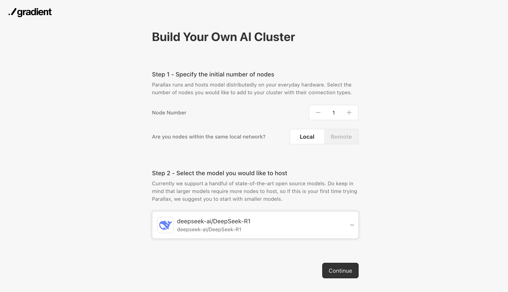
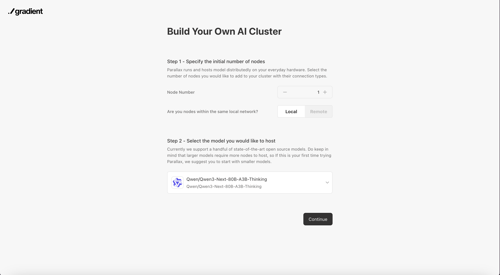
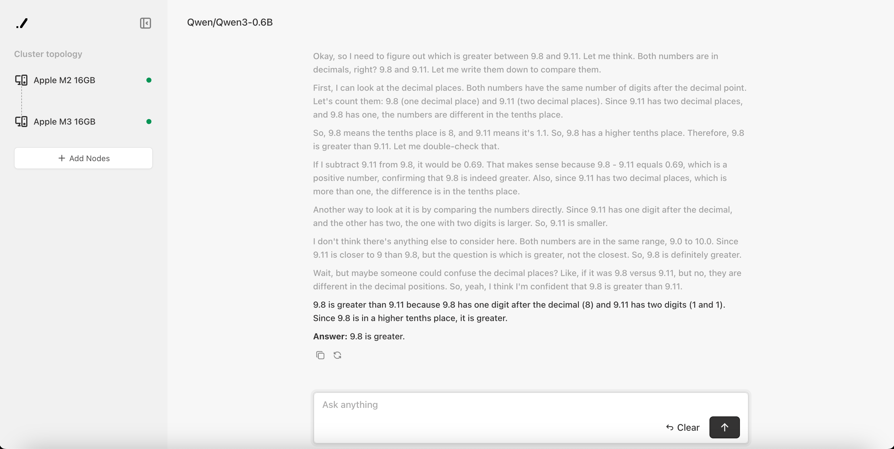

## Getting Started

We will walk through you the easiest way to quickly set up your own AI cluster.

If you have not installed Parallax yet, please refer to the [installation guide](./install.md) and follow the instructions.

### With Frontend

#### Step 1: Launch scheduler

First launch our scheduler on the main node, we recommend you to use your most convenient computer for this.
- For Linux/macOS:
```sh
parallax run
```

- For Windows, start Powershell console as administrator and run:
```sh
parallax run
```

To allow the API to be accessible from other machines, add the argument `--host 0.0.0.0` when launching scheduler.
```sh
parallax run --host 0.0.0.0
```

When running `parallax run` for the first time or after an update, the code version info might be sent to help improve the project. To disable this, use the `-u` flag:
```sh
parallax run -u
```

#### Step 2: Set cluster and model config

Open http://localhost:3001 and you should see the setup interface.



Select your desired node and model config and click continue.

> **Note:**
When running in remote mode, Parallax will use a public relay server to help establish connections between the scheduler and nodes. The public relay server will receive the IP information of both the scheduler and the nodes in order to facilitate this connection.

#### Step 3: Connect your nodes

Copy the generated join command line to your node and run. For remote connection, you can find your scheduler-address in the scheduler logs.

```sh
# local area network env
parallax join
# public network env
parallax join -s {scheduler-address}
# example
parallax join -s 12D3KooWLX7MWuzi1Txa5LyZS4eTQ2tPaJijheH8faHggB9SxnBu
```



You should see your nodes start to show up with their status. Wait until all nodes are successfully connected, and you will automatically be directed to the chat interface.

When running `parallax join` for the first time or after an update, the code version info might be sent to help improve the project. To disable this, use the `-u` flag:
```sh
parallax join -u
```

#### Step 4: Chat

Done! You have your own AI cluster now.



#### Accessing the chat interface from another non-scheduler computer

You can access the chat interface from any non-scheduler computer, not just those running a node server. Simply start the chat server with:

```sh
# local area network env
parallax chat
# public network env
parallax chat -s {scheduler-address}
# example
parallax chat -s 12D3KooWLX7MWuzi1Txa5LyZS4eTQ2tPaJijheH8faHggB9SxnBu
```

After launching, visit [http://localhost:3002](http://localhost:3002) in your browser to use the chat interface.

To allow the API to be accessible from other machines, add the argument `--host 0.0.0.0` when launching chat interface.
```sh
parallax chat --host 0.0.0.0
```

### Without frontend
#### Step 1: Launch scheduler
First launch our scheduler on the main node.
```sh
parallax run -m {model-name} -n {number-of-worker-nodes}
```
For example:
```sh
parallax run -m Qwen/Qwen3-0.6B -n 2
```
Please notice and record the scheduler ip4 address generated in the terminal.

#### Step 2: Connect your nodes
For each distributed nodes including the main node, open a terminal and join the server with the scheduler address.
```sh
# local area network env
parallax join
# public network env
parallax join -s {scheduler-address}
```
For example:
```sh
# first node
parallax join -s 12D3KooWLX7MWuzi1Txa5LyZS4eTQ2tPaJijheH8faHggB9SxnBu
# second node
parallax join -s 12D3KooWLX7MWuzi1Txa5LyZS4eTQ2tPaJijheH8faHggB9SxnBu
```

#### Step 3: Call chat api with Scheduler
```sh
curl --location 'http://localhost:3001/v1/chat/completions' --header 'Content-Type: application/json' --data '{
    "max_tokens": 1024,
    "messages": [
      {
        "role": "user",
        "content": "hello"
      }
    ],
    "stream": true
}'
```

> **Note:**
For models such as Qwen3 and gpt-oss, the "reasoning" (or "thinking") feature is enabled by default. To disable it, add `"chat_template_kwargs": {"enable_thinking": false}` to your request payload.

### Skipping Scheduler
Developers can start Parallax backend engine without a scheduler. Pipeline parallel start/end layers should be set manually.
An example of serving Qwen3-0.6B with 2-nodes:
- First node:
```sh
python3 ./parallax/src/parallax/launch.py \
--model-path Qwen/Qwen3-0.6B \
--port 3000 \
--max-batch-size 8 \
--start-layer 0 \
--end-layer 14
```
- Second node:
```sh
python3 ./parallax/src/parallax/launch.py \
--model-path Qwen/Qwen3-0.6B \
--port 3000 \
--max-batch-size 8 \
--start-layer 14 \
--end-layer 28
```

Call chat API on one of the nodes:
```sh
curl --location 'http://localhost:3000/v1/chat/completions' --header 'Content-Type: application/json' --data '{
    "max_tokens": 1024,
    "messages": [
      {
        "role": "user",
        "content": "hello"
      }
    ],
    "stream": true
}'

```

### FAQ
> Q: When deploying on cloud servers, I encounter an error like "lattica RPC call failed". What does this mean and how can I resolve it?

A: This error typically occurs when the necessary network ports for communication between the scheduler and nodes are blocked—most often due to firewall or security group settings on your cloud platform.

**How to fix:**
- Ensure that the relevant TCP/UDP ports for both the scheduler and nodes are open and accessible between all machines in your cluster.
    - By default, the scheduler uses HTTP port `3001`, and nodes use HTTP port `3000`. You can change these with the `--port` argument (e.g., `parallax run --port <your_port>` or `parallax join --port <your_port>`).
    - For Lattica (node-to-node) communication, random ports are used by default. It is best to explicitly specify which TCP and UDP ports to use (e.g., `--tcp-port <your_tcp_port> --udp-port <your_udp_port>`), and then open those ports for inbound and outbound traffic in your cloud provider's security settings.
- Check your cloud provider's firewall or network security group configurations:
    1. Open inbound rules for the ports mentioned above on all scheduler and node machines.
    2. Make sure that ports are open to the desired sources (e.g., to all cluster instances, or to your public IPs if required).

After updating the firewall/security group settings to allow these ports, restart your scheduler and nodes.

> Q: When running on macOS, I encounter the error: `error sending packet on iface address No route to host (os error 65) address=192.168.xxx.xxx`. What does this mean and how can I fix it?

A: On macOS, you need to allow your terminal or IDE (such as Terminal, iTerm2, VS Code, Cursor, etc.) access to the local network in order for Parallax to work correctly. If the application prompts you for network access the first time you run Parallax, click "Allow." If you have already denied access, follow these steps to enable it:

1. Open System Settings from the Apple menu.
2. Click on Privacy & Security in the sidebar.
3. Click on Local Network.
4. For each app listed, turn the ability to access your local network on or off using the toggle switch.

This will ensure Parallax has the proper network permissions for local communication.

> Q: When running the scheduler on Windows, nodes on other PCs cannot detect the scheduler ID over the local network. Why can't other machines join the cluster?

A: If you are running Parallax in WSL (Windows Subsystem for Linux), make sure you are using the "Mirrored" networking mode. By default, WSL uses "NAT" (Network Address Translation) mode, which isolates your WSL environment behind a virtual network. As a result, services running inside WSL (such as Parallax scheduler) are not directly accessible from other devices on the LAN.

To ensure that other machines on your network can connect to your WSL instance, change the WSL networking mode to "Mirrored" (supported on Windows 11 version 22H2 or later). In "Mirrored" mode, your WSL environment will share the same network as your host, allowing local network discovery and seamless joining of nodes to your Parallax cluster.
